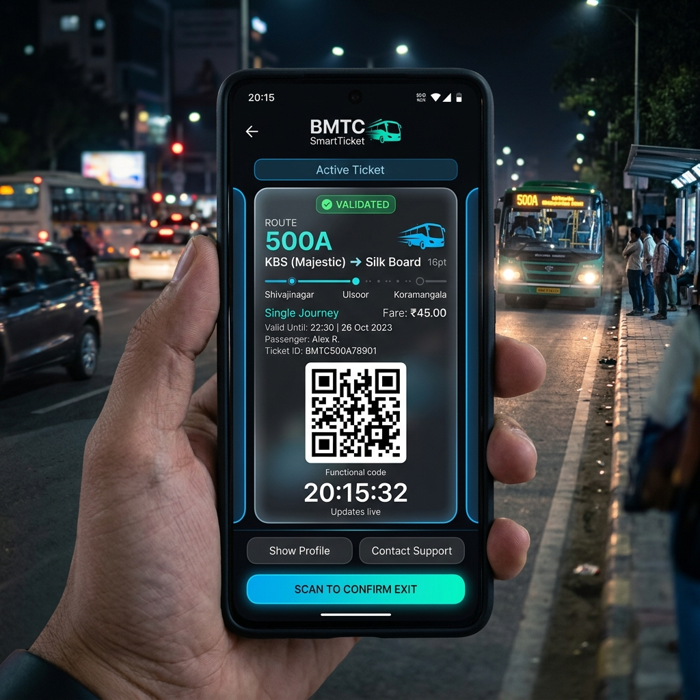

# 🎫 BMTC SmartTicket - Digital Bus Ticketing System

[](https://nextjs.org/)
[](https://nestjs.com/)
[](https://www.prisma.io/)
[](https://www.postgresql.org/)
[](LICENSE)

A modern, robust, and scalable digital bus ticketing solution designed for BMTC. This system streamlines the process of issuing, validating, and managing bus tickets using QR codes and real-time payment integration.



## 🌟 Key Features

-   **Multi-Role Access Control**:
    -   **Traveler**: Search routes, buy tickets (Cash/Online), and view digital ticket history.
    -   **Conductor**: Issue tickets on-the-go and manage passenger payments.
    -   **Supervisor**: Verify ticket validity via QR code scanning.
    -   **Admin**: Comprehensive dashboard for managing buses, routes, schedules, and monitoring fraud.
-   **QR-Based Ticketing**: Instant ticket generation and secure scanning/verification.
-   **Seamless Payments**: Integration with **Razorpay** for online transactions and a robust system for tracking cash payments.
-   **Real-Time Updates**: Powered by **Socket.io** for instant status updates and notifications.
-   **Fraud Detection**: Built-in mechanisms to detect and prevent ticket duplication or unauthorized use.

## 🚀 Tech Stack

### Frontend
-   **Framework**: Next.js 14 (App Router)
-   **Styling**: Tailwind CSS
-   **State Management**: React Hooks
-   **Icons**: Lucide React
-   **QR Scanning**: `html5-qrcode`

### Backend
-   **Framework**: NestJS
-   **Database**: PostgreSQL
-   **ORM**: Prisma
-   **Real-time**: Socket.io
-   **Payments**: Razorpay Node SDK
-   **Authentication**: JWT & Passport

## 🛠️ Project Structure

```text
├── backend/            # NestJS API
│   ├── prisma/         # Database schema & migrations
│   ├── src/            # Backend logic (Modules, Services, Controllers)
│   └── ...
├── frontend/           # Next.js Application
│   ├── app/            # App Router pages
│   ├── components/     # UI Components
│   ├── lib/            # Utilities & Axios config
│   └── ...
├── assets/             # Images & static assets
└── DEPLOYMENT.md       # Detailed deployment instructions
```

## 🚥 Getting Started

### Prerequisites
-   Node.js (v18+)
-   PostgreSQL
-   npm or yarn

### Installation

1.  **Clone the Repository**:
    ```bash
    git clone https://github.com/shreyas-sv1/digital_bus_ticket.git
    cd digital_bus_ticket
    ```

2.  **Backend Setup**:
    ```bash
    cd backend
    npm install
    cp .env.example .env # Configure your database & Razorpay keys
    npx prisma migrate dev
    npm run start:dev
    ```

3.  **Frontend Setup**:
    ```bash
    cd ../frontend
    npm install
    cp .env.example .env.local # Configure your API & Socket URLs
    npm run dev
    ```

## 📦 Deployment

Refer to the [DEPLOYMENT.md](DEPLOYMENT.md) for detailed instructions on deploying the backend to **Railway** and the frontend to **Vercel**.

## 🤝 Contributing

Contributions are welcome! Please feel free to submit a Pull Request.

## 📄 License

This project is licensed under the MIT License.
